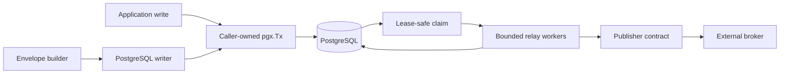
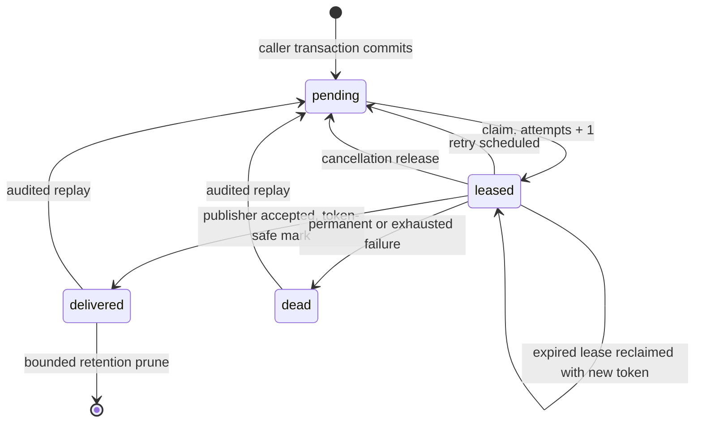

# Architecture And Recovery

## Components

Publisher adapters sit outside the core module. They cannot participate in the
application transaction and therefore cannot weaken or strengthen its atomic
persistence guarantee.

## State machine

Only `delivered` rows can be pruned. Replay accepts only complete selections of
`delivered` or `dead` rows and rolls back if any requested ID is missing or
non-terminal.

## Crash and ambiguity matrix

| Crash point | Durable state | Recovery and delivery result |
|---|---|---|
| Before application transaction commit | No committed envelope | Nothing is published. |
| After commit, before claim | `pending` | Any relay can claim it. |
| During claim statement | PostgreSQL commits all lease changes or none | Uncommitted locks disappear; committed leases recover after expiry. |
| After claim, before publish | `leased` | Cancellation can release it; process death relies on lease expiry. |
| Cancellation during publish | `leased`, then `pending` when release commits | Relay uses a detached bounded cleanup context; hard death still relies on expiry. |
| During publisher call | `leased`; publisher result may be unknown | Lease expiry causes retry; acceptance may therefore become a duplicate. |
| During lease renewal | Existing lease remains until its deadline | Renewal failure cancels publication and performs no stale transition; expiry permits reclaim. |
| Publisher panics | `leased` | Relay contains the panic as `ErrPublisherPanic`; normal classification retries or dead-letters it. Panic content is not disclosed. |
| After publisher acceptance, before delivered update | `leased` | Lease expiry republishes it. Duplicate delivery is expected. |
| During delivered update | `leased` or `delivered`; client result may be unknown | If leased, it republishes after expiry. If delivered, it is not claimed again. |
| After delivered commit | `delivered` | Normal claims exclude it; explicit replay can publish it again. |
| During retry/dead-letter/release update | Old or new state, atomically | Old lease expires/reclaims; committed new state follows its normal path. |
| During replay before commit | Terminal original state | Transaction rollback preserves every selected record and writes no audit. |
| After replay commit | `pending` plus audit | It can be published again by explicit operator intent. |
| During prune | `delivered` or deleted, atomically | No deliverable state is deleted. |

An ambiguous database response is not evidence that a transaction failed.
Operators must inspect durable state before forcing replay or repeating manual
actions.

The PostgreSQL integration suite deterministically cancels the context before
claim, lease extension, delivered, retry, dead-letter, release, replay, and
prune transitions. It asserts that message state, lease deadlines, and replay
audit remain unchanged, then executes and verifies each recovery transition
with a live context. Archive-hook failure and ambiguous post-publish delivery
have separate fault-injection cases.

## Bounds

Envelope field sizes, claim batches, administrative batches, lease duration,
relay batch size, workers, attempts, polling, transition cleanup, and retry
delay are bounded or explicitly configured. The default retry uses capped
exponential backoff with full jitter.

## Threat boundaries

- Lease tokens prevent stale-owner mutation but are not authentication tokens.
- Replay requires explicit IDs, requester, and reason; application
  authorization must wrap the API.
- Payloads and metadata are stored in PostgreSQL and sent to publishers. They
  must be treated as sensitive application data and must not be logged.
- A poison payload can repeatedly fail until maximum attempts moves it to
  `dead`; operators should inspect metadata and errors without disclosing the
  payload.
